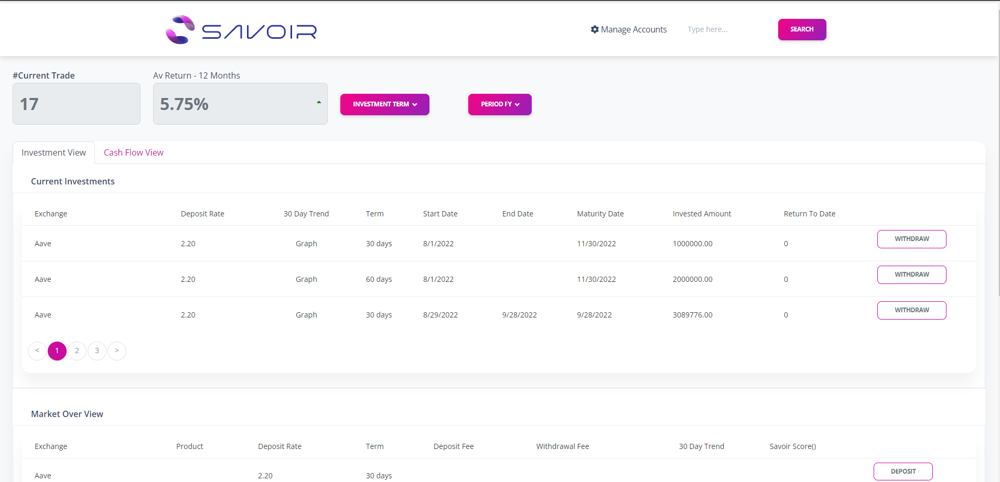
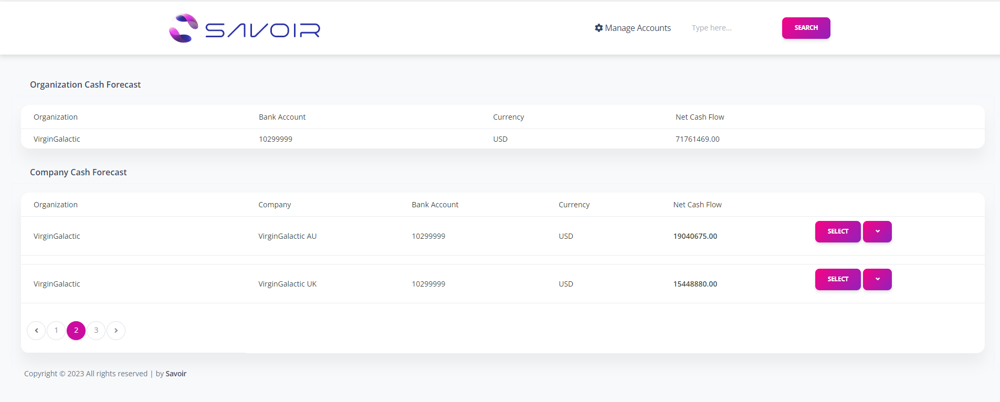
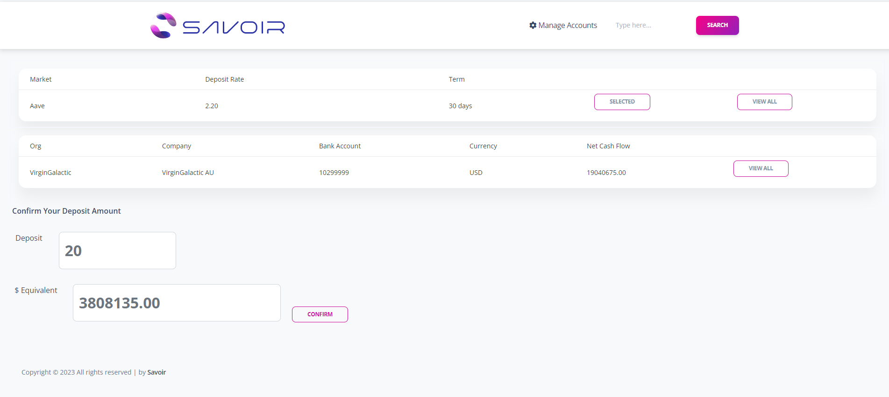
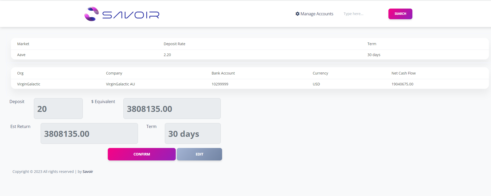

# Crypto investment
Cryptocurrency investment offers an exciting opportunity to participate in a transformative technological revolution. With blockchain technology at its core, cryptocurrencies promise decentralized solutions across various industries, from finance to healthcare. Embracing this innovation can potentially lead to significant returns on investment as the market matures. Diversifying a portfolio with carefully selected cryptocurrencies allows investors to tap into multiple growth avenues. The thriving global community, filled with enthusiasts and experts, fosters collaboration and continuous learning. As major companies and financial institutions integrate cryptocurrencies, mainstream adoption inches closer, enhancing the legitimacy of digital assets. Patient investors who understand the long-term potential can ride out market fluctuations and benefit from the groundbreaking advancements yet to come.

# Features
1. Login & Log out
2. Dashboard
3. Deposit
4. Deposit Confirmation
5. Deposit Confirm
6. withdraw

# Tools: 
1. Visual Studio 2022
3. SQL SERVER 2019
4. Entity Framework
5. Blazor Server

